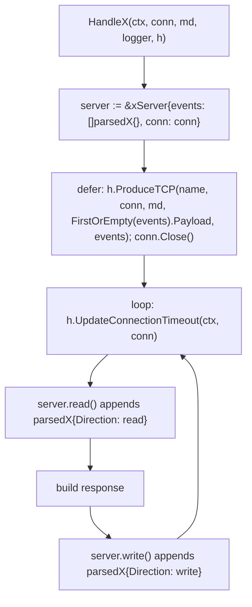

# AGENTS.md

Guidance for agents working on Glutton, with a focus on protocol handlers. Read
[CONTRIBUTING.md](CONTRIBUTING.md) for the general contribution rules and
[docs/protocols/adding-a-protocol.md](docs/protocols/adding-a-protocol.md) for the
end-to-end checklist (registration, rules, Spicy). This file describes the
canonical shape of a handler so new or refactored handlers stay consistent.

## Where things live

| Path | Purpose |
| --- | --- |
| `protocols/tcp/*.go` | One file per TCP protocol handler (`HandleSMTP`, `HandleSMB`, ...). |
| `protocols/tcp/<proto>/` | Optional sub-package with pure parsing / response-building code (e.g. `protocols/tcp/smb/`, `protocols/tcp/rdp/`). |
| `protocols/udp/*.go` | UDP handlers (`HandleUDP` catch-all, `HandleSIP`, `HandleOpenVPN`, `HandleMDNS`, `HandleL2TP`, …). |
| `protocols/protocols.go` | Handler registry: maps rule `target` names to handler funcs. |
| `protocols/interfaces/` | `Logger` and `Honeypot` interfaces every handler receives. |
| `protocols/helpers/` | `FirstOrEmpty`, `Store` (content-addressed file storage). |
| `protocols/mocks/` | mockery-generated `MockHoneypot` / `MockLogger`. |
| `producer/` | `producer.Event` envelope and sinks (log, HPFeeds, HTTP). |
| `config/rules.yaml` | Which traffic reaches which handler. |

## Canonical TCP handler

Every TCP handler follows the same lifecycle: collect everything that happens on
the connection into an in-memory slice of per-direction frames, then emit a
**single** producer event when the connection ends.



Skeleton (see `protocols/tcp/smb.go`, `ftp.go`, `smtp.go` for complete examples):

```go
package tcp

// parsedX is one frame of the session. Field names and json tags are the
// contract with downstream consumers; keep them stable.
type parsedX struct {
	Direction string   `json:"direction,omitempty"` // "read" (from attacker) or "write" (from honeypot)
	Header    x.Header `json:"header,omitempty"`    // optional: parsed protocol header
	Command   string   `json:"command,omitempty"`   // optional: verb / opcode name for text protocols
	Payload   []byte   `json:"payload,omitempty"`   // raw bytes as seen on the wire
}

type xServer struct {
	events []parsedX
	conn   net.Conn
	// protocol state (session IDs, buffered reader, ...) goes here
}

func (s *xServer) read() ([]byte, error) {
	// read one frame/line from s.conn, then:
	s.events = append(s.events, parsedX{Direction: "read", Payload: data})
	return data, nil
}

func (s *xServer) write(data []byte) error {
	if _, err := s.conn.Write(data); err != nil {
		return err
	}
	s.events = append(s.events, parsedX{Direction: "write", Payload: data})
	return nil
}

// HandleX takes a net.Conn and does basic X communication
func HandleX(ctx context.Context, conn net.Conn, md connection.Metadata, logger interfaces.Logger, h interfaces.Honeypot) error {
	server := &xServer{events: []parsedX{}, conn: conn}
	defer func() {
		if err := h.ProduceTCP("x", conn, md, helpers.FirstOrEmpty[parsedX](server.events).Payload, server.events); err != nil {
			logger.Error("Failed to produce message", slog.String("protocol", "x"), producer.ErrAttr(err))
		}
		if err := conn.Close(); err != nil {
			logger.Debug("Failed to close X connection", slog.String("protocol", "x"), producer.ErrAttr(err))
		}
	}()

	for {
		if err := h.UpdateConnectionTimeout(ctx, conn); err != nil {
			logger.Debug("Failed to set connection timeout", slog.String("protocol", "x"), producer.ErrAttr(err))
			return nil
		}
		data, err := server.read()
		if err != nil {
			logger.Debug("Failed to read data", slog.String("protocol", "x"), producer.ErrAttr(err))
			break
		}
		resp, err := buildResponse(data)
		if err != nil {
			return err
		}
		if err := server.write(resp); err != nil {
			return err
		}
	}
	return nil
}
```

### Rules

- **Signature**: `HandleX(ctx context.Context, conn net.Conn, md connection.Metadata, logger interfaces.Logger, h interfaces.Honeypot) error`. Register it in `protocols/protocols.go` under the handler key used in `config/rules.yaml`; the key is also the string passed to `ProduceTCP`.
- **One event per session**: never call `h.ProduceTCP` inside the read loop. Append to `server.events` and emit once from the deferred block. The top-level payload is `helpers.FirstOrEmpty(server.events).Payload`; the full slice is the `decoded` field.
- **Defer order**: produce first, then `conn.Close()`. Set up the defer before any I/O so a failing greeting still produces an event.
- **Timeouts**: call `h.UpdateConnectionTimeout(ctx, conn)` at the top of every loop iteration (and before the first read).
- **Error handling**: read errors, EOF, and timeout failures are expected attacker behavior. Log them with `logger.Debug` and `break`/`return nil` so the deferred produce still runs. Reserve `logger.Error` for produce/write failures and unexpected internal errors. Returning an error from the handler is fine for malformed input; it is logged by the caller.
- **Logging attributes**: always include `slog.String("protocol", "<name>")` and wrap errors with `producer.ErrAttr(err)`. Use `slog.String("handler", ...)` plus `src_ip`/`src_port`/`dest_port` for Info-level "something arrived" lines (see `ftp.go`, `mongodb.go`).
- **Reading**: binary protocols read into `make([]byte, maxBufferSize)` and copy `buffer[:n]` before storing it (buffers are reused). Length-prefixed protocols use `io.ReadFull` on the header, validate the length, then read the body (`mongodb.go`). Text protocols use a `bufio.Reader` and `ReadString('\n')` (`ftp.go`, `smtp.go`, `telnet.go`).
- **Direction**: `"read"` is data from the attacker, `"write"` is data the honeypot sent. Keep raw wire bytes in `Payload` (framing bytes included) so events can be replayed.
- **Bounding events**: cap loops and body reads (`maxDataRead` in `smtp.go`, `max_tcp_payload` in `tcp.go`). Aggregate multi-line bodies into one frame rather than one frame per line.
- **Files**: store uploaded or fetched artifacts with `helpers.Store(data, folder)` and record the returned hash in a `PayloadHash` field (`ftp.go`, `tcp.go`).
- **Parsing boundary**: byte-level parsing and response construction belong in a sub-package (`protocols/tcp/smb/`) or a `.spicy` grammar; connection lifecycle, logging, producer calls, and fake responses stay in the Go handler. Never commit generated Spicy artifacts.
- **Determinism**: anything that sleeps or randomizes (e.g. `randomSleep` in `smtp.go`) should be injectable so handler tests run instantly.
- **Do not export** handler internals; only `HandleX` is exported from `protocols/tcp`.

## Reference implementations

| Handler | Shape | Notes |
| --- | --- | --- |
| `protocols/tcp/smb.go` | binary, header-aware | Parsing/response code in `protocols/tcp/smb/`; tracks UID/TID state on the server struct. |
| `protocols/tcp/ftp.go` | line-oriented text | Opens a data connection, stores uploads with `helpers.Store`. |
| `protocols/tcp/smtp.go` | line-oriented text | `Command` verb per read frame; DATA body aggregated into one frame; injectable sleep. |
| `protocols/tcp/mongodb.go` | length-prefixed binary | `io.ReadFull` header then body; opcode names in decoded frames. |
| `protocols/tcp/telnet.go` | interactive text | Multi-step prompt flow, fetches samples asynchronously. |
| `protocols/tcp/tcp.go` | catch-all | Reads up to `max_tcp_payload`, replies with random bytes. |
| `protocols/tcp/proxy_tcp.go` | transparent proxy | Per-direction capture with byte caps and `truncated` flag. |

## Checklist for a new or changed handler

1. Handler in `protocols/tcp/<name>.go` (or `protocols/udp/<name>.go`) following the skeleton above. UDP handlers that must answer use `h.ReplyUDP(srcAddr, dstAddr, payload)`.
2. Registration in `protocols/protocols.go` (`MapTCPProtocolHandlers` / `MapUDPProtocolHandlers`) and an assertion in `protocols/protocols_test.go`.
3. Rule in `config/rules.yaml`, placed before broad catch-alls.
4. Tests beside the handler (`protocols/tcp/<name>_test.go`):
   - drive `HandleX` over `net.Pipe()` with the `fakeHoneypot` / `recordingLogger` helpers from `protocols/tcp/proxytcp_test.go` (or `mocks.MockHoneypot`);
   - assert exactly one produced event, its protocol name, and the full `[]parsedX` slice;
   - cover malformed input / early disconnect so the deferred produce path is exercised;
   - unit-test pure parsing/response functions separately (see `protocols/tcp/smb/smb_test.go`).
5. Docs in the same PR: handler key list in `docs/configuration.md`, decoded shape in `docs/logging.md`, handler notes in `.cursor/skills/analyze-glutton-events/reference.md` if the event shape is non-obvious.

## Verify

```bash
gofmt -l ./protocols
go test ./protocols/... ./rules/...
```

Run the full `CC=clang-17 CXX=clang++-17 go test ./...` (Spicy installed) before opening a PR; run `make spicy` first if any `.spicy` file changed.
