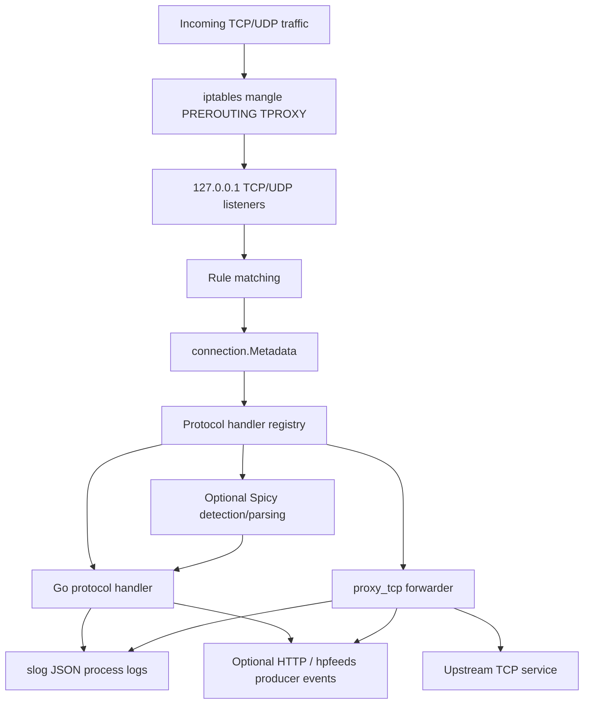

# Architecture

Glutton is built around four moving parts: transparent redirection, rule-based dispatch, protocol handlers, and optional producer output. It does not bind every public service port directly — it installs iptables TPROXY rules that redirect matching TCP and UDP traffic to local listener ports, then reconstructs enough metadata to pick a handler.

## Components

| Component | Source | Role |
| --- | --- | --- |
| CLI + runtime | `app/server.go`, `glutton.go` | Flags, init, listeners, rule load, dispatch, signal handling. |
| Listener | `server.go` | Local TCP/UDP TPROXY listeners on `127.0.0.1`. |
| iptables integration | `iptables.go` | Append/remove mangle PREROUTING TPROXY rules. |
| Rules engine | `rules/rules.go` | Compiles BPF expressions, returns the first matching rule. |
| Handler registry | `protocols/protocols.go` | Maps rule targets (`smtp`, `http`, `proxy_tcp`, `tcp`, …) to handler funcs. |
| TCP/UDP handlers | `protocols/tcp/`, `protocols/udp/` | Protocol interaction, logging, producer calls, fake responses. |
| Spicy bridge | `protocols/spicy/` | Initializes Spicy/HILTI runtime; parses selected payloads. |
| Logging | `producer/logger.go` | JSON `slog` to stdout + rotating file. |
| Producers | `producer/producer.go` | Optional structured events to HTTP / hpfeeds. |

## Startup

1. `app/server.go` parses flags and binds them into Viper.
2. `glutton.New(...)` builds the connection table, reads or writes the sensor ID under `--var-dir`, creates the logger, loads config and rules.
3. `glutton.Init()` resolves public addresses for `interface`, starts the local TCP/UDP listeners, initializes optional producers, builds the handler maps, and initializes Spicy if `spicy.enabled` is true.
4. `glutton.Start()` installs the iptables TPROXY rules and starts the listener loops.

The sensor ID is stored as binary UUID data in `<var-dir>/glutton.id`. Default `--var-dir` is `/var/lib/glutton`.

## TCP dispatch

1. Connection is redirected to the local TCP listener; Glutton accepts it.
2. `applyRulesOnConn(...)` runs the rule set against the connection's remote and local addresses.
3. If no rule matches, a fallback rule with target `default` is synthesized.
4. The connection is registered in the table and the connection timeout is applied.
5. If the rule type is `proxy_tcp`, the proxy handler runs. Otherwise the handler for the matched target runs in a goroutine.

## UDP dispatch

1. A UDP packet is read from the local UDP listener with original source/destination addresses preserved.
2. The rules engine runs with network type `udp`.
3. If no rule matches, target `udp` is used.
4. The packet is registered and the handler runs in a goroutine.

Today the UDP handler map only contains the generic `udp` handler.

## Spicy boundary

Spicy is optional, gated by `spicy.enabled`. When on, the Spicy/HILTI runtime is initialized and compiled parser modules are registered. Current usage:

- `TCP::Protocol` inspects raw TCP payload bytes in the generic `tcp` handler path; detected HTTP, RDP, or MongoDB payloads route to more specific handling.
- `HTTP::Request` parses HTTP request bytes for the Spicy HTTP handler path.

Spicy does not replace Go protocol handlers. The parser extracts fields from bytes; Go still owns reads, writes, fake responses, logging, producer calls, timeouts, and fallback behavior.

One routing wrinkle: a rule with target `http` calls the Go HTTP handler directly. The Spicy HTTP handler is reached *only* from the generic `tcp` catch-all path when Spicy detection classifies the payload as HTTP.

## Output

Process logs always go through `slog` JSON to stdout and the configured `--logpath` file (rotated via lumberjack). Producer events are separate and only emitted when `producers.enabled` and a sink (`producers.http.enabled` or `producers.hpfeeds.enabled`) are on. See [Logging and producers](logging.md).
