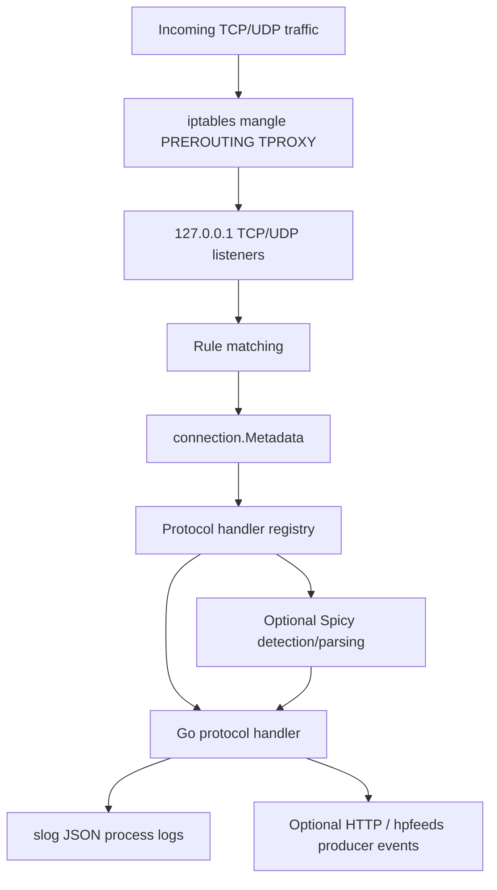

# Architecture

Last verified against source on 2026-05-15.

Glutton is built around transparent redirection, rule-based dispatch, protocol handlers, and optional producer output. The important point is that Glutton does not bind every public service port directly. It installs iptables TPROXY rules that redirect matching TCP and UDP traffic to local listener ports, then reconstructs enough metadata to choose a handler.

## Components

| Component | Source | Role |
| --- | --- | --- |
| CLI entrypoint | `app/server.go` | Defines flags, initializes Glutton, handles shutdown signals. |
| Core runtime | `glutton.go` | Loads config and rules, starts listeners, applies rules, dispatches handlers, manages shutdown. |
| Listener | `server.go` | Creates local TCP and UDP TPROXY listeners on `127.0.0.1`. |
| iptables integration | `iptables.go` | Appends and removes mangle table PREROUTING TPROXY rules. |
| Rules engine | `rules/rules.go` | Compiles BPF expressions and returns the first matching rule. |
| Connection metadata | `connection/connection.go` | Stores source, target port, rule, and timestamp in an in-memory table. |
| Handler registry | `protocols/protocols.go` | Maps rule targets such as `smtp`, `http`, or `tcp` to Go handler functions. |
| TCP/UDP handlers | `protocols/tcp/`, `protocols/udp/` | Perform protocol interaction, logging, producer calls, and responses. |
| Spicy bridge | `protocols/spicy/` | Initializes the Spicy/HILTI runtime and parses selected payloads. |
| Logging | `producer/logger.go` | Writes JSON process logs to stdout and a rotating log file. |
| Producers | `producer/producer.go` | Sends optional structured events to HTTP or hpfeeds sinks. |

## Startup Flow

1. `app/server.go` parses flags and binds them into Viper.
2. `glutton.New(...)` creates the connection table, creates or reads the sensor ID under `--var-dir`, creates the logger, loads config, and loads rules.
3. `glutton.Init()` resolves public addresses for the configured interface, starts the local TCP and UDP listeners, initializes optional producers, builds the handler maps, and initializes Spicy if `spicy.enabled` is true.
4. `glutton.Start()` installs iptables TPROXY rules for TCP and UDP and then starts the TCP and UDP listener loops.

The sensor ID is stored as binary UUID data in `<var-dir>/glutton.id`. The default `--var-dir` is `/var/lib/glutton`.

## Traffic Flow

### TCP

1. A connection is redirected to the local TCP listener.
2. Glutton accepts the connection.
3. `applyRulesOnConn(...)` runs the rule set against the connection's remote and local addresses.
4. If no rule matches, Glutton creates a fallback rule with target `default`.
5. The connection is registered in the connection table.
6. The configured connection timeout is applied.
7. If the target exists in the TCP handler map, Glutton runs the handler in a goroutine.

The TCP handler map is static today. It includes named handlers for SMTP, RDP, SMB, FTP, SIP, RFB/VNC, Telnet, MQTT, iSCSI, BitTorrent, Memcache, Jabber, ADB, MongoDB, HTTP, and generic TCP.

### UDP

1. A UDP packet is read from the local UDP listener with original source and destination addresses.
2. Glutton applies the same rules engine with network type `udp`.
3. If no rule matches, Glutton uses target `udp`.
4. The packet is registered in the connection table.
5. If the UDP handler map contains the target, Glutton runs the handler in a goroutine.

The current UDP handler map contains the generic `udp` handler.

## Rules And Dispatch

Rules are loaded from `rules_path`, usually `config/rules.yaml`. If that path does not exist, Glutton falls back to the embedded default rules. Rule matching uses `pcap.NewBPF(...)` with Ethernet link type and a synthetic packet built from the connection addresses.

The first matching rule wins. A rule target must match a registered handler key to run code. See [Rules engine](rules-engine.md) for details and caveats.

## Spicy Boundary

Spicy is optional and controlled by `spicy.enabled`. When enabled, Glutton initializes the Spicy/HILTI runtime and registers compiled parser modules.

Today Spicy is used in selected paths:

- `TCP::Protocol` inspects raw TCP payload bytes in the generic `tcp` handler path and can route detected HTTP, RDP, or MongoDB traffic to more specific handling.
- `HTTP::Request` parses HTTP request bytes for the Spicy HTTP handler path.

Spicy does not replace Go protocol handlers. The parser extracts fields from bytes. Go still owns reads, writes, fake responses, logging, producer calls, timeouts, and fallback behavior.

One important routing detail: a rule with target `http` currently calls the Go HTTP handler directly. The Spicy HTTP handler is reached from the generic `tcp` catch-all path when Spicy detection classifies the payload as HTTP.

## Logging And Output

Process logs always go through `slog` JSON output. The logger writes to stdout and to the configured `--logpath` file through a rotating lumberjack writer.

Producer events are separate. They are only emitted when `producers.enabled` creates a producer and individual sinks such as `producers.http.enabled` or `producers.hpfeeds.enabled` are enabled. See [Logging and producers](logging.md) for the event schema.

## Shutdown

On interrupt or SIGTERM, Glutton cancels its context, removes the TCP and UDP TPROXY rules it installed, and cleans up the Spicy/HILTI runtime when Spicy was enabled.
